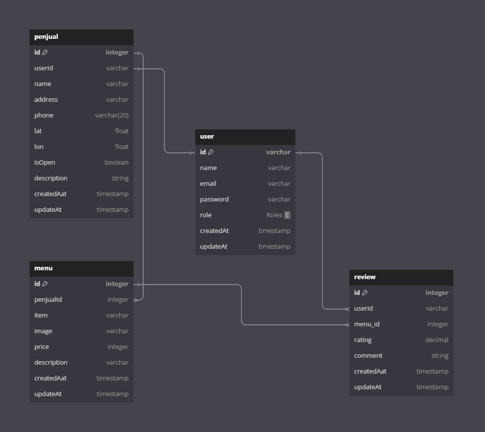
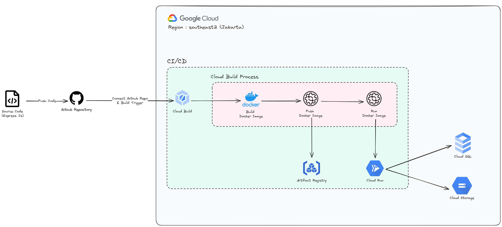

<div align="center">
<h1 align="center">JajanJalan REST API</h1>
 <p align="center">
    Back-end implementation for our application
    <br />
    <!-- <a href="https://github.com/entry-point-community/v6-app"><strong>Explore the docs »</strong></a>
    <br /> -->
    <br />
    <a href="https://github.com/asyarbre/jajanjalan-api/issues">Report Bug</a>
    ·
    <a href="https://github.com/asyarbre/jajanjalan-api/issues">Request Feature</a>
  </p>
</div>

<!-- TABLE OF CONTENTS -->
<h4>Table of Contents</h4>
<ol>
  <li>
    <a href="#about-the-project">About The Project</a>
    <ul>
      <li><a href="#built-with">Built With</a></li>
      <li><a href="#database-design">Database Design</a></li>
      <li><a href="#cicd-environment">CI/CD Environment</a></li>
    </ul>
  </li>
 <li>
    <a href="#getting-started">Getting Started</a>
    <ul>
      <li><a href="#prerequisites">Prerequisites</a></li>
      <li><a href="#setup-and-installation">Setup and Installation</a></li>
    </ul>
 </li>
 <li><a href="#usage">Usage</a></li>
 <li><a href="#api-endpoints">API Endpoints</a></li>
 <li><a href="#contact">Contact</a></li>
 <li><a href="#association">Association</a></li>
</ol>
<!-- ABOUT THE PROJECT -->

## About The Project
This is the back-end service repository for JajanJalan. These services provide the functionality and logic required to support the front-end of the JajanJalan application. These back-end services are responsible for handling tasks such as data storage, processing, and retrieval, as well as providing APIs to interact with the front-end.

### Built With
- **ExpressJs**: Framework [ExpressJS](https://expressjs.com)
- **Prisma**: Object Relational Mapping [Prisma](https://www.prisma.io)
- **MySQL**: Relational Databases
- **Validation**: Request data validation using [Joi](https://github.com/hapijs/joi)
- **Dotenv**: Environment variables access [dotenv](https://www.npmjs.com/package/dotenv)
- **Jsonwebtoken**: JSON Web Tokens [jwt](https://jwt.io)
- **CORS**: Cross-Origin Resource-Sharing enabled using [cors](https://github.com/expressjs/cors)
- **Multer**: File request handler [multer](https://www.npmjs.com/package/multer)
- **CI**: Continuous Integration with [Cloud Build](https://cloud.google.com/build)
- **Docker**: Containerization with [Docker](https://www.docker.com)

### Database Design


### CI/CD Environment

For the CI/CD Environment, we use Cloud Build with push trigger. When a revision / update to the code is pushed, the diagram as shown above will run the process of revision. Below are the services we use from Google Cloud Platform to develop CI/CD pipeline :
1. Cloud Build : To create a trigger
1. Artifact Registry: For the docker images repository
1. Cloud Run: To run the application

## Getting Started
Getting started, do follow the steps below thoroughly and carefully. Make sure all the prerequisities and installations are done correctly according to

### Prerequisites
Before getting started, make sure that NPM is already up to date.
- npm
  ```sh
  npm install npm@latest -g
  ```
### Setup and installation
#### 1. Install packages
```sh
$ npm install
```

#### 2. Setup env files
Several `.env.template` files have been created for you. Create your own `.env` to be used in your project. Adjust the needed values accordingly.

#### 3. Prisma Migrate
Create a Prisma migration to sync changes in your `schema.prisma` to your database.
```sh
$ npx prisma migrate deploy
```

#### 4. Running
```sh
$ npm run dev
```

## Usage
REST API is used for JajanJalan Application front-end

## API Endpoints
List of available routes:

**Authentication routes**:\
`POST /users/register` - register\
`POST /users/login` - login\
`POST /users/logout` - logout\
`GET /users/:userId` - detail user\
`PATCH /users/:userId` - update user

**Penjual routes**:\
`POST /penjual/create` - create penjual\
`GET /penjual` - get all penjual\
`GET /penjual/penjualId` - get by penjual id\
`PATCH /penjual/penjualId` - update penjual\
`DELETE /penjual/penjualId` - delete penjual

**Menu routes**:\
`POST /menu/create` - create menu\
`GET /menu` - get all menu\
`GET /menu/menuId` - get by menu id\
`GET /menu/penjual/penjualId` - get by penjual id\
`GET /menu/search?item=namaMakanan` - search menu\
`PATCH /menu/menuId` - update menu\
`DELETE /menu/menuId` - delete menu

**Review routes**:\
`POST /review/create` - create review\
`GET /review` - get all review\
`GET /review/penjual/penjualId` - get by penjual id\
`PATCH /review/:id` - update review

## Contact
- Asya'ri - [LinkedIn](https://www.linkedin.com/in/asyari1)
- Project Link: [https://github.com/asyarbre/jajanjalan-api](https://github.com/asyarbre/jajanjalan-api)

## Association
- [Bangkit](https://grow.google/intl/id_id/bangkit)
